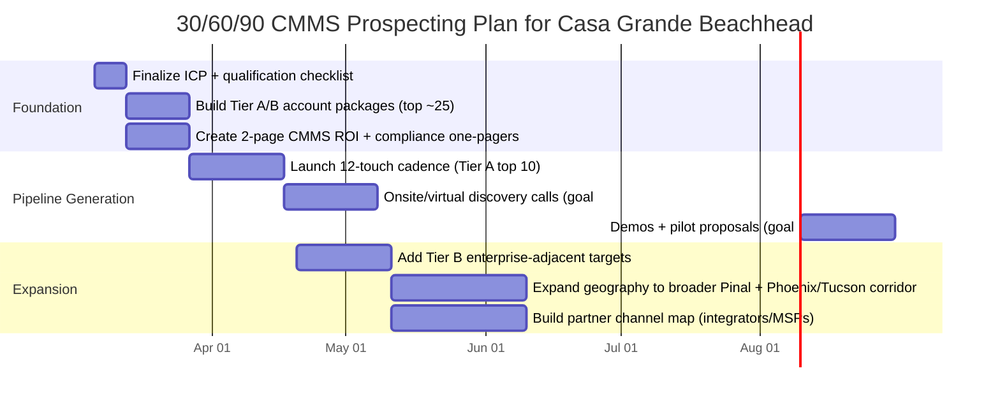
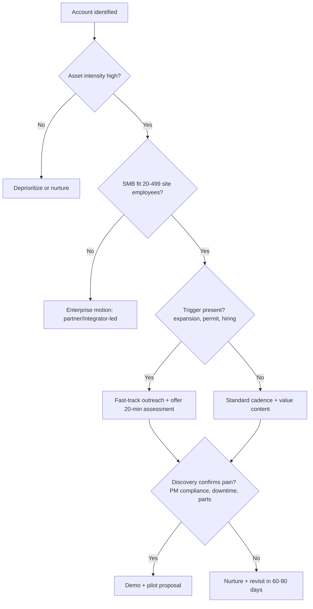

# CMMS Prospecting Landscape for Small and Medium Manufacturers in Casa Grande and Nearby Arizona Markets

## Executive summary

Casa Grande and the surrounding central-Pinal corridor sit on an unusually “maintenance-dense” mix of food processing, plastics/packaging, fabricated metals, industrial recycling, and permitted industrial/chemical operations—exactly the facility types that benefit from preventive maintenance, spare-parts discipline, compliance documentation, and uptime reporting that a computerized maintenance management system (CMMS) enables. citeturn11view0turn13search3turn12search19turn9search7turn14search19

This report identifies a verified, outreach-ready target list anchored by official/local sources (city economic development, county permitting, chamber directories) plus regulatory datasets (EPA TRI, OSHA) and company-published contacts. The top targets skew toward small/medium sites where CMMS adoption is often “spreadsheet-to-system” (fast sales cycle, high ROI) rather than ERP/EAM replacement. citeturn11view0turn9search9turn13search3turn12search19turn14search19

Key takeaways:
- **Highest-probability CMMS prospects (near-term):** multi-shift manufacturing and process/industrial operations with visible equipment intensity—engineered foam packaging, polymer concrete/fiberglass/metal product manufacturing, lead fabrication/anode production, truck body fabrication, metal recovery/recycling, asphalt products processing, and smaller machine shops. citeturn9search7turn10search1turn7view0turn10search0turn14search19turn13search13turn8view0
- **Strong “trigger” opportunities:** facilities expanding footprint (e.g., EFP occupancy expansion; new facilities such as FrameTec) where CMMS can be positioned as part of commissioning/startup standard work. citeturn9search30turn5view0
- **Strategic/enterprise targets (longer cycle):** large branded manufacturers in Casa Grande (food, glass, composites, plumbing fixtures) that may already run enterprise EAM/ERP modules but still buy add-ons or plant-level modernization projects. citeturn11view0turn6view0turn13search3
- **Excluded by request:** Lucid Motors is intentionally excluded from the prospect list. citeturn11view0

## Research approach and sources used

### Search methods and why they were prioritized

Primary/official and high-signal sources used to identify manufacturing sites and validate facility addresses/operations:

- **Local chambers and membership directories:** the Greater Casa Grande Chamber of Commerce member directory (including “Manufacturers & Distribution Centers”) to discover plant/facility names, addresses, and public phone numbers. citeturn9search9turn10search36turn9search2turn9search1  
- **Municipal economic development / employer lists:** the City of Casa Grande “Major Industrial Employers” list to validate which large plants are active locally and confirm addresses. citeturn11view0  
- **County permitting / environmental compliance:** entity["organization","Pinal County","arizona local government"] Title V and permit pages used to confirm “type of operation,” site addresses, and permit timing (useful for compliance-driven CMMS messaging). citeturn13search3turn1search10turn1search11turn13search24  
- **Federal regulatory datasets:**  
  - entity["organization","U.S. Environmental Protection Agency","federal agency"] TRI facility profiles for publicly listed facility contacts (when available). citeturn13search7  
  - entity["organization","Occupational Safety and Health Administration","us labor agency"] inspection detail pages (confirm addresses and NAICS for certain industrial sites). citeturn12search19  
- **Company-published facility pages:** plant/location pages for direct facility contacts (e.g., plant manager, phone). citeturn10search10turn6view0turn14search19turn12search10  
- **State economic development announcements:** entity["organization","Arizona Commerce Authority","state economic development"] releases for “new facility / expansion” leads including square footage and job creation. citeturn5view0  
- **LinkedIn company pages:** used *only* to estimate employee size bands and confirm locations for small/medium firms where official counts are not published. citeturn10search0turn10search1turn7view0turn8view0turn14search0  
- **Commercial real estate / industrial development:** development pages and industrial market reports to validate facility footprint and expansion signals (useful to time outreach). citeturn9search30turn9search29

## Prospecting criteria and filters

### Definition of small and medium for this project

Because “SMB” varies by industry and there is no single universal threshold, this report applies a pragmatic, CMMS-selling definition aligned to how establishment data is commonly segmented and how maintenance organizations are staffed:

- **Small:** ~20–99 employees at the site (or similar scale implied by available public sources)  
- **Medium:** ~100–499 employees at the site  
- **Notes on data quality:** employee counts are often shown as **ranges** (e.g., LinkedIn “11–50”) or inferred from public notices; these are treated as estimates, not audited headcount. citeturn10search0turn10search1turn7view0turn8view0turn12search33

### Geographic scope

“Nearby” is treated as **central Pinal County and the I‑8 / AZ‑84 / AZ‑87 corridor**: Casa Grande plus nearby communities such as entity["city","Eloy","Arizona, US"], entity["city","Coolidge","Arizona, US"], entity["city","Florence","Arizona, US"], entity["city","Maricopa","Arizona, US"], and the northern edge of entity["city","Tucson","Arizona, US"] / southern entity["city","Phoenix","Arizona, US"] metro where relevant for spillover industrial clusters. citeturn11view0turn9search9turn1search10

### Facility types included and excluded

Included (CMMS-relevant, asset-heavy):
- Discrete manufacturing (fabricated metals, transportation equipment, building products, packaging) citeturn13search24turn10search0turn9search7turn5view0  
- Process manufacturing (food, supplements, asphalt products, lubricants recycling/refining) citeturn11view0turn13search13turn12search19turn10search7  
- Industrial recycling / metal recovery operations with significant process equipment citeturn14search33turn14search0  
- Permitted industrial/chemical operations where compliance and inspections benefit from CMMS traceability citeturn13search3turn12search19

Excluded (lower CMMS fit or out of scope):
- Pure distribution/warehousing (unless a site also runs significant packaging/processing lines) citeturn11view0  
- Construction-only contractors without a maintained production facility  
- Lucid Motors (explicitly excluded by the user) citeturn11view0

### Prioritization model used

Targets were prioritized using a simple, sales-practical scoring logic:
- **Maintenance intensity:** number/criticality of production assets, utilities, and safety/compliance requirements  
- **SMB fit:** likelihood of not already being locked into a large enterprise EAM and ability to buy quickly  
- **Trigger signals:** expansions, new buildings, permitting activity, commissioning, or hiring for maintenance/quality  
- **Reachability:** presence of facility-level contact info or plant leadership roles publicly discoverable citeturn9search30turn13search7turn10search10turn14search19turn12search19

## Prioritized candidate companies and facilities

The table below emphasizes Casa Grande first, then nearby cities. NAICS codes are **best-fit** based on operation descriptions in permits, regulator pages, or company descriptions; where an authoritative NAICS is visible (e.g., OSHA, EPA, county permits), it is cited as such. citeturn13search24turn12search19turn13search13turn13search15turn5view0

### Prospect list with outreach-ready details

| Priority tier | Company / facility | Address (city) | Industry & NAICS (best-fit) | Size indicator (est.) | Contact info / role to target | Why strong CMMS prospect |
|---|---|---|---|---|---|---|
| A | entity["company","ACO, Inc.","drainage products manufacturer"] | 825 W Beechcraft St (Casa Grande) citeturn10search16turn10search36 | Manufacturing (polymer concrete, fiberglass, steel drainage products); NAICS ~326/332 (best-fit) citeturn10search1turn10search9 | 51–200 employees (company size band) citeturn10search1 | 1‑800‑543‑4764; info@acousa.com; target: Plant/Operations/Maintenance Manager citeturn10search16 | Multi-material production + likely preventive maintenance needs (mixing/casting, fabrication, molds, material handling). Strong SMB fit + clear contacts. citeturn10search1turn10search9turn10search16 |
| A | entity["company","EFP, LLC.","engineered foam packaging"] | 1341 S Sunland Gin Rd (Casa Grande) citeturn9search7 | Protective / cold-chain packaging manufacturing; NAICS ~326140/322 (best-fit) citeturn9search7turn9search30 | Company size 201–500 (site likely smaller); facility footprint signal: ~152,200 SF (industrial report) citeturn9search26turn9search29 | (520) 464‑6430; target: Maintenance Manager / Reliability / Plant Engineer citeturn9search7 | Expansion trigger: expected to occupy both buildings in “The Confluence” by early 2026—classic CMMS standardization moment across lines/buildings. citeturn9search30turn9search12 |
| A | entity["company","Metal Solutions AZ LLC","hydrometallurgical recycling"] | 1551 N VIP Blvd (Casa Grande) citeturn14search19turn14search8 | Industrial recycling / metal recovery; NAICS ~331/562 (best-fit) citeturn14search33turn14search0 | 11–50 employees citeturn14search0 | +1 (520) 876‑5784; info@metalsolutionsaz.com; named roles: President & Owner, Logistics Manager, VP Business Dev citeturn14search19turn14search8 | Process-intense (hydro/pyromet), environmental/safety orientation—CMMS helps inspection schedules, critical spares, and audit-ready records. citeturn14search33turn14search19 |
| A | entity["company","Seafab Metals Company","lead fabrication"] | 1112 N VIP Blvd (Casa Grande) citeturn7view0turn9search9 | Lead fabrication (nuclear shielding/anodes); NAICS ~332999/331492 (best-fit) citeturn7view0 | 11–50 employees (LinkedIn band) citeturn7view0 | 520‑421‑3200; target: Plant Manager / Quality / Maintenance Lead citeturn9search9 | Specialized fabrication with quality/regulatory expectations; CMMS supports calibration, PM, and traceability for audits. citeturn7view0 |
| A | entity["company","Spartan Truck Manufacturing, Inc.","refuse truck manufacturer"] | 1441 N VIP Blvd (Casa Grande) citeturn10search0 | Transportation equipment manufacturing; NAICS 336212 (truck trailer manufacturing) (best-fit) citeturn10search0 | 11–50 employees citeturn10search0 | Target: Plant Manager / Fabrication Supervisor / Maintenance Lead (facility location confirmed) citeturn10search0 | Fabrication + assembly environment (weld, paint, hydraulics, material handling). CMMS improves preventive maintenance and downtime tracking. citeturn10search0 |
| A | entity["company","R & J Manufacturing Inc.","cnc machining"] | 1230 W Gila Bend Hwy (Casa Grande) citeturn8view0 | CNC machining / repair & field machining; NAICS ~332710 (best-fit) citeturn8view0 | 11–50 employees citeturn8view0 | Target: Owner/GM + Shop Foreman + Maintenance (CNC uptime); website listed citeturn8view0 | Smaller shop where a lightweight CMMS can replace whiteboards/spreadsheets: PM intervals, tool crib/spares, and work order history for quoting. citeturn8view0 |
| A | entity["company","Sheffield Lubricants LLC","used oil processing"] | 148 S Commerce Dr (Casa Grande) citeturn11view0turn12search19 | Petroleum refineries NAICS 324110 (OSHA record) citeturn12search19 | Small operator signal: 11–20 employees (est.) citeturn12search15 | (800) 640‑0625 (FMCSA); target: Plant/Operations Manager, Maintenance Supervisor citeturn12search11turn12search19 | Compliance-heavy process operation; CMMS is valuable for inspections, preventive maintenance, and documenting corrective actions. citeturn12search19turn11view0 |
| A | entity["company","Wright Asphalt Products Company","asphalt products manufacturer"] | 110 S Commerce Dr (Casa Grande) citeturn11view0turn13search13 | Asphalt paving mixture & block manufacturing NAICS 324121 (EPA) citeturn13search13 | Small org signal: 11–50 employees (LinkedIn band) citeturn14search7 | Target: Plant Supervisor + Lab/Quality Lead (site appears in ADOT lab listing) citeturn33search33turn13search33 | Materials processing + lab/testing; CMMS helps schedule PM for heaters/conveyance, manage critical spares, and document maintenance tied to quality. citeturn13search13turn13search9 |
| A | entity["company","Republic Plastics","foam products manufacturer"] | 1550 W Battaglia Rd (Eloy) citeturn9search9turn1search11 | Polystyrene foam manufacturing (county permit); NAICS ~326140 (best-fit) citeturn1search10turn1search11 | Medium-likelihood SMB (size not published in official sources located) | 520‑466‑3219; target: Plant Manager / Maintenance Supervisor citeturn9search9 | Foam lines and material handling are uptime-sensitive; CMMS supports PM, downtime root cause, and spare part discipline. citeturn1search10 |
| A | entity["company","FrameTec","building components manufacturer"] | Central Arizona Parkway & I‑8 corridor (Casa Grande area) citeturn5view0 | Panelized building components and framing; NAICS 321214 (truss/building components best-fit) citeturn5view0 | New facility: 300,000 SF; planned opening timeline 2026; projected ~250 jobs at full buildout citeturn5view0 | Target: VP Ops / Plant Manager / Maintenance Manager (commissioning stage) citeturn5view0 | Greenfield startup is ideal for “CMMS-as-standard-work,” asset hierarchy, PM templates, spare parts, and contractor onboarding from day one. citeturn5view0 |
| B | entity["company","Price Industries, Inc.","hvac components manufacturing"] | 999 N Thornton Rd (Casa Grande) citeturn11view0turn13search0 | Light sheet metal stamping/forming + assembly/painting; NAICS 332322 (county permit) citeturn13search24 | Medium/large plant (exact site headcount not published here) | 520‑423‑0515; target: Plant Maintenance/Engineering Manager citeturn13search0 | Metal forming + paint + material handling; CMMS can standardize PM and manage MRO inventory, especially if multiple lines/areas. citeturn13search24 |
| B | entity["company","Hexcel Corporation","aerospace honeycomb manufacturer"] | 1214 W Gila Bend Hwy / AZ‑84 (Casa Grande) citeturn13search3turn13search27 | Structural honeycomb manufacturing (Title V); NAICS 322200 noted in draft permit citeturn13search3turn13search15 | Likely enterprise-scale (site headcount not published here) | Public TRI contact + phone + email listed (facility profile); target: EHS/Facilities/Maintenance leadership citeturn13search7 | Permitted manufacturing with compliance requirements; CMMS value in inspection evidence, calibration, PM traceability, and downtime analytics. citeturn13search3turn13search7 |
| B | entity["company","National Vitamin Co Inc","dietary supplement manufacturer"] | 1145 W Gila Bend Hwy (Casa Grande) citeturn10search7 | Dietary supplement manufacturing; NAICS ~325411/311 (best-fit) citeturn10search7 | 201–500 band (LinkedIn); alternate estimate: ~90 employees (GovTribe) citeturn10search7turn10search11 | Target: Plant Manager / Quality / Maintenance Manager; phone listed on chamber category page citeturn9search9 | “Fully automated” facility positioning suggests high reliance on uptime + QA; CMMS supports PM, calibration, and deviation documentation. citeturn10search7 |
| B | entity["company","RSR Anode","rolled lead anode manufacturer"] | 602 S Swanson St (Casa Grande) citeturn9search2turn9search18 | Anode manufacturing (lead); NAICS ~331492 (best-fit) citeturn9search18 | Likely SMB/medium site (exact headcount not published here) | 520‑426‑9385; mining/industrial directory lists an engineering sales manager role citeturn9search2turn9search6 | Specialized fabrication with heavy QA and safety considerations; CMMS helps manage PM, inspections, tooling, and traceability. citeturn9search18turn9search28 |
| B | entity["company","Bull Moose Tube","steel tube manufacturer"] | 1001 N Jefferson Ave (Casa Grande) citeturn11view0turn10search10 | Steel pipe/tube manufacturing; NAICS ~331210/331111 (best-fit) citeturn10search10 | Plant scale likely large; (local jobs show maintenance hiring) citeturn10search17 | Plant manager named + phone listed; target: Plant Manager + Maintenance Manager citeturn10search10 | If not already standardized on EAM, this is maintenance-heavy (mills, forming, cutting). If already on EAM, candidate for add-on/mobile/contractor workflows. citeturn10search10 |
| B | entity["company","Daisy Brand","dairy products manufacturer"] | 752 W Ash Ave (Casa Grande) citeturn11view0turn12search17 | Dairy processing (sour cream/cottage cheese); NAICS ~311511 (best-fit) citeturn12search32 | Large company (501–1,000 band) citeturn12search21 | 520‑876‑0200; target: Plant Engineering / Maintenance & Reliability citeturn12search17 | Food processing plants benefit from PM, sanitation/asset scheduling, spare parts, and downtime reporting; likely already has systems—position as process upgrade. citeturn12search32 |
| B | entity["company","Graham Packaging","plastic packaging manufacturer"] | 1172 W Lawrence St (Casa Grande) citeturn11view0turn12search16 | Plastics packaging; NAICS ~326160 (best-fit) citeturn11view0 | Enterprise parent; site size not published here | Facility address confirmed; target: Plant Manager / Maintenance Supervisor citeturn12search16 | Blow-molding/packaging lines are uptime-sensitive; CMMS supports PM and spares discipline. citeturn11view0 |
| C | entity["company","Franklin Foods, Inc.","cream cheese manufacturer"] | 1221 W Gila Bend Hwy (Casa Grande) citeturn12search10turn11view0 | Cream cheese manufacturing; NAICS ~311513 (best-fit) citeturn12search18 | WARN notice: 83 employees affected (closure context) citeturn12search33turn12search6 | 520‑316‑3757; target: Asset buyer / new operator / facility manager citeturn12search10 | Plant closure/asset sale environment can create opportunities with a new owner needing fast maintenance system standardization—treat as opportunistic lead. citeturn12search6turn12search33 |
| C | entity["company","Kohler","plumbing fixtures manufacturer"] | Casa Grande facility (opened 2024; 1M SF) citeturn6view0 | Bath/shower fixtures manufacturing; NAICS ~326199/327 (best-fit) citeturn6view0 | ~1,000,000 SF facility; major employer scale citeturn6view0 | Target: Reliability/Engineering leadership (enterprise target) | Likely sophisticated automation and maintenance org; position only if you can compete for enterprise EAM/CMMS modernization, mobility, or specialty use cases. citeturn6view0 |

**What’s not shown (but recommended to add in your CRM):** internal plant “CMMS readiness” fields (current workflow: paper/spreadsheet/ERP module), maintenance headcount estimate, union/non-union, and whether the site runs multiple shifts—these are strong predictors of CMMS urgency. citeturn11view0

## Outreach strategy and messaging for the top prospects

### How to position CMMS for this corridor

For small/medium manufacturers in this market, CMMS positioning that tends to win:
- **“Reduce downtime + make PM consistent”** for fabrication, packaging, and plastic/foam sites where line stoppages are expensive. citeturn9search7turn10search0turn1search10  
- **“Audit-ready maintenance records”** for permitted/process sites (lubricants, asphalt products, permitted manufacturing) where inspection documentation matters. citeturn12search19turn13search13turn13search3  
- **“Commissioning playbook”** for expansions/greenfield facilities: asset hierarchy, spare parts, PM libraries, contractor onboarding, start-up checklists. citeturn9search30turn5view0

### Recommended 12-touch cadence

A practical cadence for plant decision-makers (maintenance + operations) in this region:

1. Day 1: Email + LinkedIn connect (if available)  
2. Day 3: Phone call + voicemail referencing a specific facility trigger (permit/expansion)  
3. Day 6: Email with a 1-page “maintenance maturity checklist” and offer a 20-minute walkthrough  
4. Day 10: Second call; ask for correct maintenance lead if contact is wrong  
5. Day 14: Email with a “starter package” promise: asset hierarchy + PM templates in 2 weeks  
6. Day 21: Drop-by (if local) or short video message (45–60 sec)  
7. Day 30: “Close the loop” email—ask if they want a quote or to revisit next quarter

This cadence is designed to be respectful of plant workloads while consistently adding value and referencing *their* site specifics (addresses, expansions, permitted operation types). citeturn9search30turn12search19turn13search3turn14search19

### Tailored messaging hooks for the top 10

Below are outreach angles you can reuse; each is anchored to a verifiable public “hook” from the research above:

- **ACO**: “You’re producing across polymer concrete, fiberglass, and steel lines—do you have one place to schedule PM and track downtime by line and mold/tooling?” citeturn10search1turn10search9turn10search16  
- **EFP**: “With expansion/space growth in Casa Grande, are you standardizing PM schedules, parts, and contractor workflows across both buildings before the footprint fully ramps?” citeturn9search30turn9search7  
- **Metal Solutions**: “For process equipment plus strong safety posture, a CMMS can centralize recurring inspections, PM, and corrective action records—especially across hydro/pyromet systems.” citeturn14search33turn14search19  
- **Seafab Metals**: “For specialized lead fabrication and quality standards, CMMS can map calibration/inspection intervals and keep audit trails without paper binders.” citeturn7view0  
- **Spartan Truck Manufacturing**: “We help fabrication shops reduce ‘surprise downtime’ on welders, paint/finish, and material handling with simple PM + parts tracking.” citeturn10search0  
- **R & J Manufacturing**: “For CNC and field machining, we can track PM by machine hours, capture work history for repeat jobs, and manage spare parts/tool crib.” citeturn8view0  
- **Sheffield Lubricants**: “OSHA NAICS indicates refinery-type operations; CMMS is often the fastest way to prove inspections/maintenance were done on schedule.” citeturn12search19turn12search11  
- **Wright Asphalt**: “EPA indicates asphalt mixture/block manufacturing; CMMS can tie maintenance events to asset performance and QC/lab schedules.” citeturn13search13turn13search9  
- **Republic Plastics (Eloy)**: “Foam manufacturing lines + uptime: CMMS helps standardize PM and reduce repeat failures with downtime reasons and parts usage.” citeturn1search10turn9search9  
- **FrameTec (new facility)**: “New build = best time to stand up a clean asset registry and PM library so maintenance isn’t reactive in the first year.” citeturn5view0

### Message templates you can copy/paste

**Email template (maintenance leader)**  
Subject: Quick question on PM + downtime tracking at your Casa Grande facility  
Hi [Name] — I work with manufacturers in the Casa Grande / central Pinal corridor to reduce unplanned downtime and simplify preventive maintenance. I noticed [facility-specific hook: expansion / permitted operation / multi-line materials]. citeturn9search30turn12search19turn10search16  
If it’s useful, I can share a 20-minute walk-through of how similar sites set up: asset hierarchy → PM schedules → work orders → spare parts tracking (lightweight, not an ERP replacement).  
Would you be the right person to ask about maintenance systems, or is there a maintenance supervisor/plant engineer I should contact?

**Voicemail talk track (30 seconds)**  
“Hi [Name], this is [You]. I’m calling because I work with asset-heavy plants in the Casa Grande area on preventive maintenance, work orders, and spare parts tracking. I noticed [specific site signal]. If you’re open to it, I’d like to ask two quick questions about how you currently schedule PM and track downtime. My number is [x].” citeturn9search30turn11view0  

## Estimated market size and competitor landscape in Arizona

### Market sizing: what can be stated with high confidence from public data

From the entity["organization","U.S. Census Bureau","federal statistical agency"] County Business Patterns API (2022), **Arizona has 159,857 establishments (all sectors) with paid employees** and reported employment of **2,787,701** (all sectors). This provides a scale reference for how many employer sites exist statewide, though it is not manufacturing-only. citeturn27view0turn19search1

For Casa Grande specifically, the city’s economic development list shows a substantial concentration of industrial employers spanning food, packaging, glass, composites, lubricants recycling/refining, asphalt products, and more. citeturn11view0

**Bottom-up “serviceable market” (conservative floor):** this research verified **~15–25** manufacturing/industrial sites in Casa Grande and immediately adjacent cities with enough public information to begin outreach immediately (addresses + facility identity confirmed), with **~10** ranked as high-probability small/medium CMMS prospects. citeturn9search9turn11view0turn13search3turn12search19turn14search19

### Market sizing: recommended way to quantify in your CRM within 2–3 weeks

To tighten TAM/SAM/SOM for Arizona manufacturing without relying on guesswork:
- Use CBP (manufacturing NAICS 31–33) establishment counts by county and size class (CBP supports this structure via NAICS and employment size class). citeturn19search1turn15search0  
- Overlay with an internal “ideal customer profile” (ICP) filter: 20–499 employees, continuous operations or high equipment density, multi-site potential. citeturn19search1turn15search0  
- Treat central Pinal as “Beachhead 1,” then expand into the broader Phoenix–Tucson manufacturing corridor.

### Competitor landscape and adjacent system competitors

Your sales motion will compete against three buckets:

- **Enterprise EAM/ERP maintenance modules (common in larger plants):**  
  - CMMS “replacement” deals are harder here; position as phased modernization or narrow use-cases (mobile work execution, contractor portals, faster deployment for a new building).  
  - Signals that this bucket matters locally: active IBM Maximo user communities and conferences in the Phoenix region. citeturn33search6turn33search10turn33search18  

- **Local/regional system integrators for enterprise platforms:**  
  - IBM Maximo ecosystem: entity["organization","Fields Consulting","ibm maximo user group sponsor"] sponsors the Arizona Maximo User Group (AZMUG), indicating local partner activity around Maximo. citeturn33search10  
  - An IBM Maximo implementation partner presence has been publicly associated with Phoenix-area events (e.g., MaximoWorld announcements). citeturn33search34turn33search6  
  - SAP ecosystem: entity["organization","Phoenix Business Consulting","sap partner"] and entity["organization","Optima","sap gold partner"] both position as SAP partners with Phoenix presence, relevant because SAP Plant Maintenance / EAM often competes with CMMS in mid-to-large manufacturers. citeturn33search12turn33search36  

- **Other CMMS and maintenance-software vendors reachable in Arizona:**  
  - Industrial directories such as entity["organization","GlobalSpec","industrial supplier directory"] list CMMS software suppliers in Arizona (by city), useful for identifying who is marketing locally. citeturn33search17  
  - entity["organization","Thomasnet","industrial supplier directory"] lists “maintenance management software” suppliers located in Arizona, another indicator of competitive availability (though listings may include adjacent categories). citeturn33search25  

Practical implication: **For SMB manufacturers in Casa Grande**, your best competitive wedge is speed-to-value (rapid onboarding, prebuilt PM libraries, parts/spares workflows) and plant-level outcomes (downtime, PM compliance, audit readiness), rather than feature-by-feature comparisons with enterprise platforms. citeturn13search3turn12search19turn9search30

## Recommended next steps and a 30/60/90-day action plan

### Immediate next steps

1. Build a CRM “account package” for each Tier A prospect: facility address, operation type, estimated employee band, named roles, and a one-sentence trigger hook. citeturn10search16turn9search7turn14search19turn7view0turn12search19  
2. For each Tier A account, add 3–5 target roles: Maintenance Manager, Plant Engineer, Operations Manager, Reliability Engineer, EHS/Compliance (for permitted sites), and Purchasing/Procurement (for spare-parts workflows). citeturn13search7turn10search10turn14search19  
3. Create a “commissioning play” deck for new/expanding facilities (EFP/FrameTec): asset hierarchy setup, PM library, QR-coded assets, and contractor onboarding. citeturn9search30turn5view0  

### 30/60/90 plan

### Qualification flow to keep outreach efficient

### What success looks like by day 90

- A validated “beachhead” list of **10 Tier A** targets with active conversations, plus **15+ Tier B** nurtures. citeturn9search9turn11view0turn13search3turn12search19turn14search19  
- 6–8 discovery calls completed; 2–3 proposals/pilots in motion.  
- A repeatable message library segmented by plant type (food, plastics/packaging, fabricated metal, recycling/process, permitted facilities). citeturn11view0turn13search24turn14search33turn12search19turn9search7