# Atlas CMMS — System Architecture

> **Version:** 1.0  
> **Last Updated:** March 5, 2026

---

## Table of Contents

1. [High-Level Overview](#1-high-level-overview)
2. [Infrastructure Diagram](#2-infrastructure-diagram)
3. [Frontend Architecture](#3-frontend-architecture)
4. [Backend Architecture](#4-backend-architecture)
5. [Database Schema (Entity Map)](#5-database-schema-entity-map)
6. [API Endpoints Reference](#6-api-endpoints-reference)
7. [Authentication & Security Flow](#7-authentication--security-flow)
8. [Data Flow](#8-data-flow)
9. [Deployment Architecture](#9-deployment-architecture)
10. [Port Reference](#10-port-reference)

---

## 1. High-Level Overview

Atlas CMMS (Computerized Maintenance Management System) is a full-stack web application for managing maintenance operations, assets, work orders, preventive maintenance, inventory, and more.

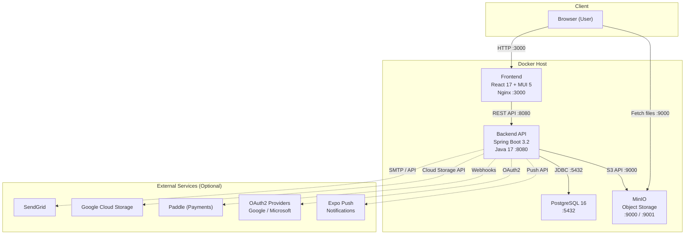

---

## 2. Infrastructure Diagram

All core services run as Docker containers orchestrated by Docker Compose.

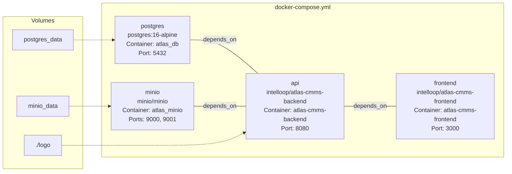

### Service Dependencies

| Service      | Image                                          | Container Name         | Depends On         |
|-------------|------------------------------------------------|------------------------|--------------------|
| **postgres** | `postgres:16-alpine`                           | `atlas_db`             | —                  |
| **minio**    | `minio/minio:RELEASE.2025-04-22T22-12-26Z`    | `atlas_minio`          | —                  |
| **api**      | `intelloop/atlas-cmms-backend`                 | `atlas-cmms-backend`   | postgres, minio    |
| **frontend** | `intelloop/atlas-cmms-frontend`                | `atlas-cmms-frontend`  | api                |

---

## 3. Frontend Architecture

### Technology Stack

| Layer              | Technology                                  |
|-------------------|---------------------------------------------|
| Framework          | React 17.0.2 + TypeScript 4.7              |
| UI Library         | Material-UI (MUI) 5.8                      |
| State Management   | Redux Toolkit 1.8 + React-Redux 8          |
| Routing            | React Router 6.3                           |
| Forms              | Formik 2.2 + Yup 0.32                      |
| Charts             | ApexCharts + Recharts                       |
| Calendar           | FullCalendar                                |
| i18n               | i18next (14 languages)                      |
| Authentication     | JWT (custom) + Auth0 SDK (optional SSO)     |
| Build              | Create React App + Nginx                    |

### Frontend Component Architecture

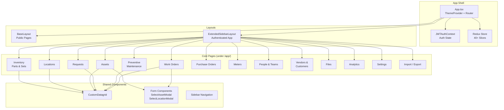

### State Management — Redux Slices

```mermaid
graph LR
    subgraph "Redux Store (rootReducer)"
        direction TB
        S1["workOrders"]
        S2["assets"]
        S3["requests"]
        S4["preventiveMaintenances"]
        S5["locations"]
        S6["parts / multiParts"]
        S7["meters / readings"]
        S8["purchaseOrders"]
        S9["users / teams / roles"]
        S10["vendors / customers"]
        S11["notifications"]
        S12["categories (7 types)"]
        S13["files"]
        S14["analytics (5 types)"]
        S15["checklists / tasks"]
        S16["workflows"]
        S17["imports / exports"]
        S18["subscriptionPlans / license"]
    end
```

### Frontend Routing Map

| Route                              | Page                         | Auth Required |
|------------------------------------|------------------------------|:------------:|
| `/`                                | Landing / Overview           | No           |
| `/account/login`                   | Login                        | No           |
| `/account/register`                | Registration                 | No           |
| `/account/recover-password`        | Password Recovery            | No           |
| `/oauth2/success`                  | OAuth Callback               | No           |
| `/app/work-orders`                 | Work Orders List & Detail    | Yes          |
| `/app/preventive-maintenances`     | PM Schedules                 | Yes          |
| `/app/requests`                    | Work Requests                | Yes          |
| `/app/assets`                      | Assets List & Detail         | Yes          |
| `/app/locations`                   | Locations List & Detail      | Yes          |
| `/app/inventory/parts`             | Parts Inventory              | Yes          |
| `/app/inventory/sets`              | Part Sets                    | Yes          |
| `/app/purchase-orders`             | Purchase Orders              | Yes          |
| `/app/meters`                      | Meters & Readings            | Yes          |
| `/app/people-teams/people`         | Users                        | Yes          |
| `/app/people-teams/teams`          | Teams                        | Yes          |
| `/app/vendors-customers/vendors`   | Vendors                      | Yes          |
| `/app/vendors-customers/customers` | Customers                    | Yes          |
| `/app/files`                       | File Management              | Yes          |
| `/app/categories`                  | Category Management          | Yes          |
| `/app/analytics/*`                 | Analytics Dashboards         | Yes          |
| `/app/settings/*`                  | System Settings              | Yes          |
| `/app/imports/*`                   | Bulk Import                  | Yes          |

### API Communication

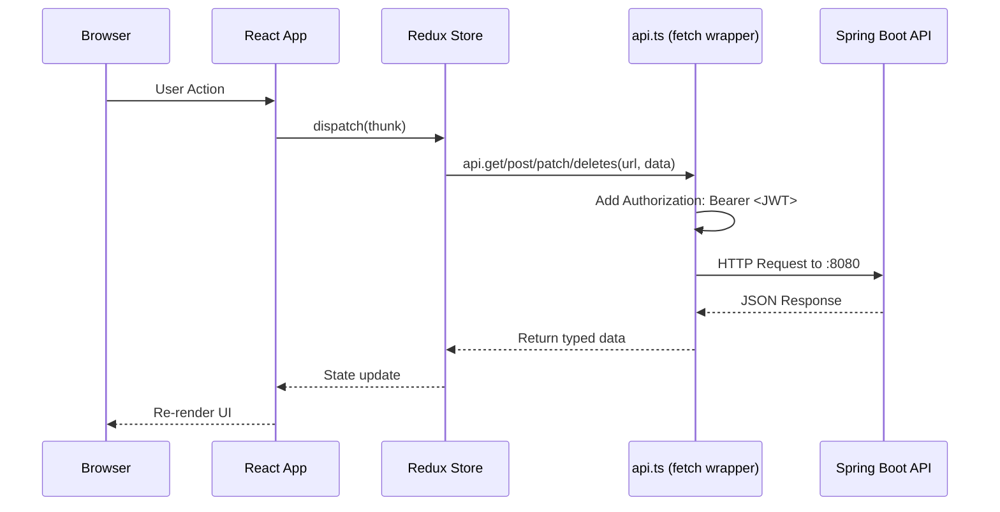

**Base URL resolution:**
- Development: `http://localhost:8080/`
- Production: `window.__RUNTIME_CONFIG__.API_URL` (injected at container startup via `runtime-env-cra`)

---

## 4. Backend Architecture

### Technology Stack

| Layer              | Technology                                   |
|-------------------|----------------------------------------------|
| Framework          | Spring Boot 3.2.3                           |
| Language           | Java 17                                      |
| ORM                | Spring Data JPA + Hibernate 6               |
| Database           | PostgreSQL 16                                |
| Migrations         | Liquibase 4.22                               |
| Security           | Spring Security + JWT (jjwt 0.11.5)          |
| File Storage       | MinIO (default) or Google Cloud Storage      |
| Email              | SMTP (default) or SendGrid                   |
| Scheduling         | Quartz                                       |
| Caching            | Caffeine                                     |
| Rate Limiting      | Bucket4j                                     |
| API Docs           | SpringDoc OpenAPI 2.5 (Swagger UI)           |
| PDF Generation     | iText + html2pdf                             |
| Auditing           | Hibernate Envers                             |

### Backend Package Architecture

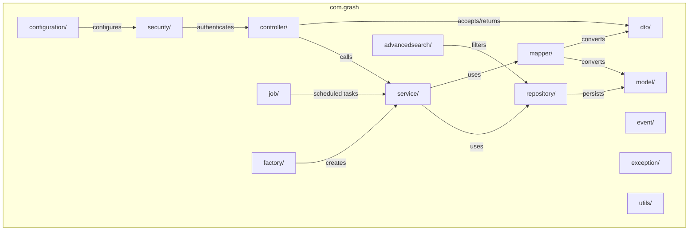

### Service Layer — Factory Pattern

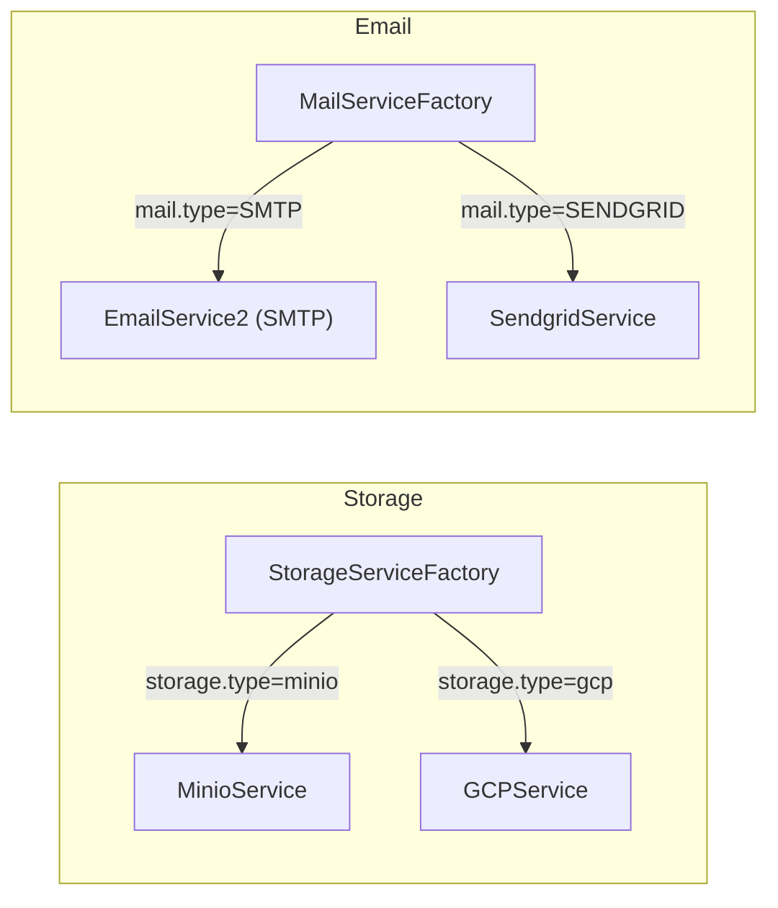

### Scheduled Jobs (Quartz)

| Job                                   | Schedule     | Purpose                                         |
|---------------------------------------|-------------|--------------------------------------------------|
| `WorkOrderCreationJob`                | Cron-based  | Creates work orders from PM schedules            |
| `PreventiveMaintenanceNotificationJob`| Cron-based  | Sends reminders for upcoming PM tasks            |
| `SubscriptionEndJob`                  | Cron-based  | Handles subscription expiration                  |
| `DeleteDemoCompaniesJob`              | Every 1 hour| Cleans up demo company data                      |

---

## 5. Database Schema (Entity Map)

### Core Domain Entities

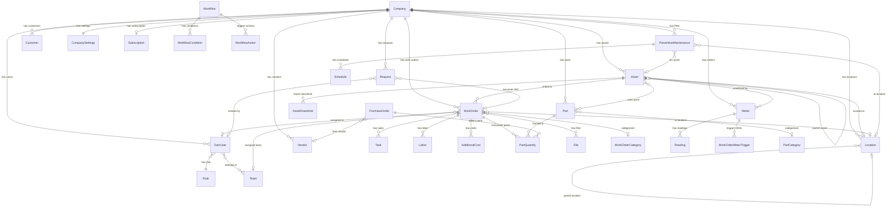

### Full Entity List

| Entity | Description |
|--------|-------------|
| **Company** | Tenant / organization |
| **CompanySettings** | Company-level configuration |
| **OwnUser** | Application user |
| **Role** | User role with permissions |
| **Team** | Group of users |
| **UserInvitation** | Pending user invite |
| **UserSettings** | Per-user preferences |
| **SuperAccountRelation** | Cross-company access link |
| **Asset** | Physical asset / equipment |
| **AssetCategory** | Asset classification |
| **AssetDowntime** | Asset downtime record |
| **Location** | Physical location (hierarchical) |
| **WorkOrder** | Maintenance work order |
| **WorkOrderCategory** | Work order classification |
| **WorkOrderConfiguration** | WO field configuration |
| **WorkOrderRequestConfiguration** | Request form configuration |
| **WorkOrderHistory** | WO change audit trail |
| **WorkOrderMeterTrigger** | Meter-based WO trigger |
| **Request** | Work request (pre-WO) |
| **PreventiveMaintenance** | PM schedule definition |
| **Schedule** | Cron/calendar schedule |
| **Task** / **TaskBase** / **TaskOption** | Checklist tasks |
| **Checklist** | Reusable task checklist |
| **Part** | Inventory part |
| **PartCategory** | Part classification |
| **PartQuantity** | Part usage in WO/PO |
| **PartConsumption** | Part consumption record |
| **MultiParts** | Multi-part group |
| **Meter** | Equipment meter |
| **MeterCategory** | Meter classification |
| **Reading** | Meter reading value |
| **PurchaseOrder** | Parts purchase order |
| **PurchaseOrderCategory** | PO classification |
| **Vendor** | Parts/service vendor |
| **Customer** | Customer record |
| **Labor** | Labor time entry |
| **AdditionalCost** | Extra cost entry |
| **CostCategory** / **TimeCategory** | Cost/time classifications |
| **File** | Uploaded file metadata |
| **FloorPlan** | Location floor plan |
| **Notification** | In-app notification |
| **PushNotificationToken** | Mobile push token |
| **Workflow** / **WorkflowAction** / **WorkflowCondition** | Automation workflow |
| **CustomField** | Custom data field |
| **FieldConfiguration** | Field visibility config |
| **GeneralPreferences** | System preferences |
| **UiConfiguration** | UI display settings |
| **Currency** | Currency definition |
| **Deprecation** | Asset depreciation |
| **Relation** | Entity-to-entity link |
| **Subscription** / **SubscriptionPlan** | Billing subscription |
| **SubscriptionChangeRequest** | Plan change request |
| **CustomSequence** | Auto-numbering sequence |
| **VerificationToken** | Email verification token |

---

## 6. API Endpoints Reference

### Core CRUD Resources

| Controller | Base Path | Methods |
|-----------|-----------|---------|
| AuthController | `/auth` | POST signin, POST signup, GET me, GET refresh, GET resetpwd, POST updatepwd, DELETE logout |
| WorkOrderController | `/work-orders` | POST search, GET/POST/PATCH/DELETE `{id}`, status change, file management |
| PreventiveMaintenanceController | `/preventive-maintenances` | POST search, GET/POST/PATCH/DELETE `{id}` |
| RequestController | `/requests` | POST search, GET/POST/PATCH/DELETE `{id}`, approve, cancel |
| AssetController | `/assets` | POST search, GET/POST/PATCH/DELETE `{id}`, NFC/barcode lookup |
| LocationController | `/locations` | POST search, GET/POST/PATCH/DELETE `{id}`, children |
| PartController | `/parts` | POST search, GET/POST/PATCH/DELETE `{id}` |
| MeterController | `/meters` | POST search, GET/POST/PATCH/DELETE `{id}` |
| PurchaseOrderController | `/purchase-orders` | POST search, GET/POST/PATCH/DELETE `{id}`, respond |
| VendorController | `/vendors` | POST search, GET/POST/PATCH/DELETE `{id}` |
| CustomerController | `/customers` | POST search, GET/POST/PATCH/DELETE `{id}` |
| UserController | `/users` | POST search, POST invite, PATCH `{id}`, disable, soft-delete |
| TeamController | `/teams` | POST search, GET mini |
| FileController | `/files` | POST upload, POST search, GET/PATCH/DELETE `{id}` |

### Supporting Resources

| Controller | Base Path | Key Operations |
|-----------|-----------|----------------|
| TaskController | `/tasks` | CRUD per work order or PM |
| LaborController | `/labors` | CRUD per work order |
| AdditionalCostController | `/additional-costs` | CRUD per work order |
| PartQuantityController | `/part-quantities` | CRUD per work order or PO |
| ReadingController | `/readings` | CRUD per meter |
| AssetDowntimeController | `/asset-downtimes` | CRUD per asset |
| WorkOrderMeterTriggerController | `/work-order-meter-triggers` | CRUD per meter |
| NotificationController | `/notifications` | List, search, read-all, push token |
| RoleController | `/roles` | CRUD |
| WorkflowController | `/workflows` | CRUD |
| ChecklistController | `/checklists` | CRUD |

### Category Resources (all CRUD)

`/asset-categories`, `/part-categories`, `/work-order-categories`, `/purchase-order-categories`, `/meter-categories`, `/cost-categories`, `/time-categories`

### Configuration & Settings

| Controller | Base Path |
|-----------|-----------|
| CompanyController | `/companies` |
| CompanySettingsController | `/company-settings` |
| GeneralPreferencesController | `/general-preferences` |
| WorkOrderConfigurationController | `/work-order-configurations` |
| WorkOrderRequestConfigurationController | `/work-order-request-configurations` |
| FieldConfigurationController | `/field-configurations` |
| UiConfigurationController | `/ui-configurations` |
| UserSettingsController | `/user-settings` |
| CurrencyController | `/currencies` |

### Analytics

| Controller | Base Path |
|-----------|-----------|
| WOAnalyticsController | `/analytics/work-orders` |
| AssetAnalyticsController | `/analytics/assets` |
| PartAnalyticsController | `/analytics/parts` |
| RequestAnalyticsController | `/analytics/requests` |
| UserAnalyticsController | `/analytics/users` |

### System / Admin

| Controller | Base Path | Purpose |
|-----------|-----------|---------|
| ImportController | `/import` | Bulk CSV import |
| ExportController | `/export` | CSV/Excel export |
| HealthCheckController | `/health-check` | Liveness probe |
| LicenseController | `/license/state` | License validation |
| PaddleController | `/paddle` | Payment management |
| WebhookController | `/webhooks/paddle-webhook` | Payment webhooks |
| DemoController | `/demo` | Demo data generation |
| SwaggerAccessController | `/swagger/swagger-session` | Swagger auth session |

---

## 7. Authentication & Security Flow

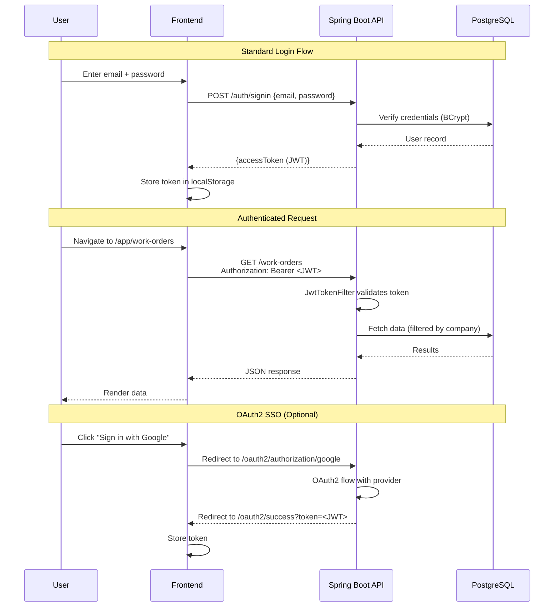

### Security Layers

| Layer | Implementation |
|-------|---------------|
| **Transport** | HTTPS (via reverse proxy) |
| **Authentication** | JWT tokens (stateless sessions) |
| **Authorization** | Role-based (RBAC) with `@PreAuthorize` |
| **Data Isolation** | Company-scoped queries on every request |
| **Password Storage** | BCrypt (strength 12) |
| **Rate Limiting** | Bucket4j |
| **CORS** | Configurable via `ENABLE_CORS` |

### Permission Model

Roles contain granular permissions for each entity type:
- `createPermissions` — create access per entity
- `viewPermissions` — read access per entity (own-only or all)
- `editOtherPermissions` — edit others' records
- `deleteOtherPermissions` — delete others' records

---

## 8. Data Flow

### Work Order Lifecycle

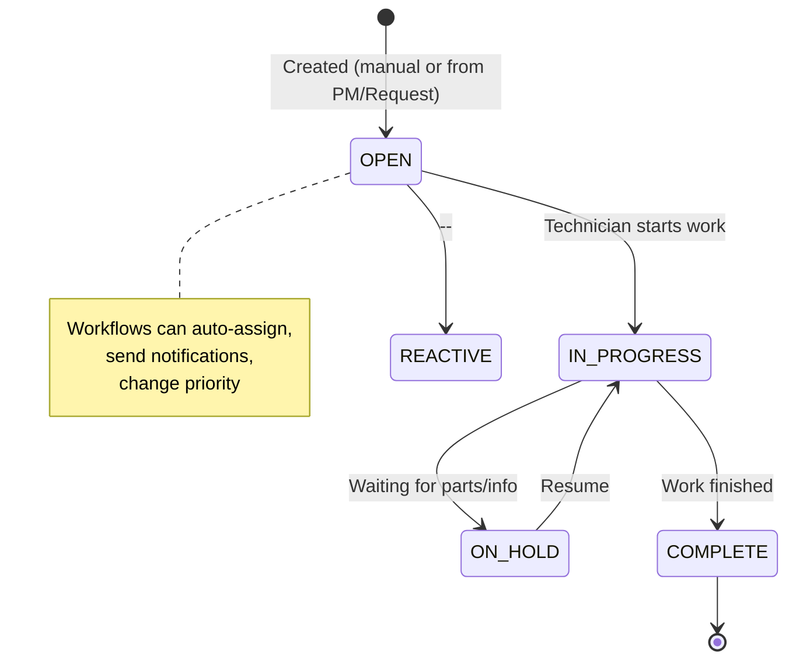

### Request → Work Order Flow

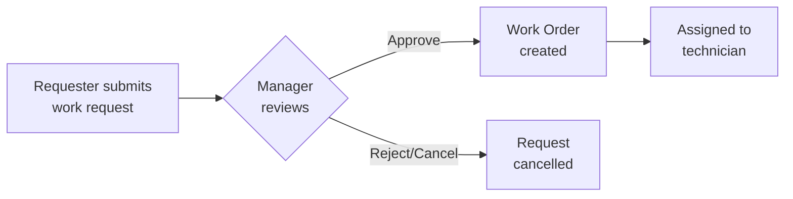

### Preventive Maintenance Automation

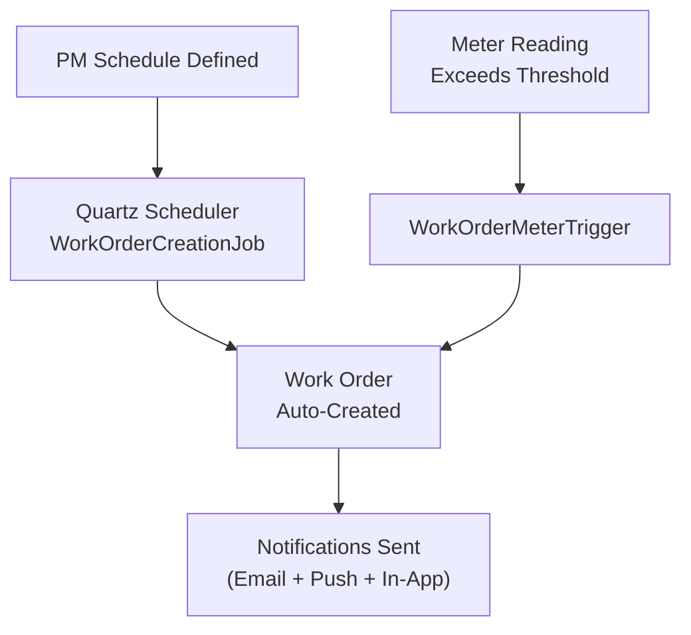

---

## 9. Deployment Architecture

### Production (Docker Compose)

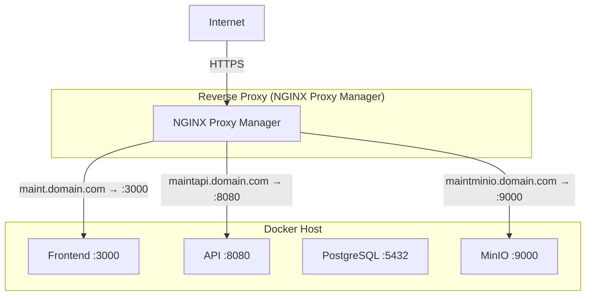

### Local Development

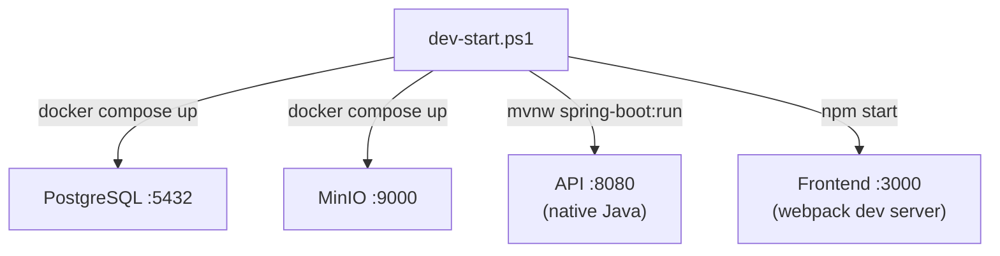

Run `dev-start.ps1` to start all services locally. Run `dev-stop.ps1` to stop them.

---

## 10. Port Reference

| Port  | Service             | Protocol | Notes                          |
|-------|--------------------|---------|---------------------------------|
| 3000  | Frontend (Nginx)    | HTTP    | React SPA                      |
| 8080  | Backend API         | HTTP    | Spring Boot REST + Swagger UI   |
| 5432  | PostgreSQL          | TCP     | Database                        |
| 9000  | MinIO API           | HTTP    | S3-compatible object storage    |
| 9001  | MinIO Console       | HTTP    | Web-based admin UI              |

### Key URLs

| URL | Description |
|-----|-------------|
| `http://localhost:3000` | Frontend application |
| `http://localhost:8080` | Backend API |
| `http://localhost:8080/swagger-ui/index.html` | Swagger API documentation |
| `http://localhost:9001` | MinIO admin console |

---

## Appendix: Environment Variables

| Variable | Service | Description |
|----------|---------|-------------|
| `POSTGRES_USER` | PostgreSQL | Database username |
| `POSTGRES_PWD` | PostgreSQL | Database password |
| `MINIO_USER` | MinIO | MinIO root username |
| `MINIO_PASSWORD` | MinIO | MinIO root password |
| `JWT_SECRET_KEY` | API | Secret for signing JWT tokens |
| `PUBLIC_API_URL` | API + Frontend | Public-facing API URL |
| `PUBLIC_FRONT_URL` | API | Public-facing frontend URL |
| `PUBLIC_MINIO_ENDPOINT` | API + Frontend | Public-facing MinIO URL |
| `STORAGE_TYPE` | API | `minio` or `gcp` |
| `ENABLE_CORS` | API | Enable CORS headers |
| `ENABLE_EMAIL_NOTIFICATIONS` | API | Enable email sending |
| `MAIL_TYPE` | API | `SMTP` or `SENDGRID` |
| `LICENSE_KEY` | API | Product license key |
| `ENABLE_SSO` | Frontend | Enable OAuth2 SSO buttons |
| `API_URL` | Frontend | Backend API URL for frontend |
